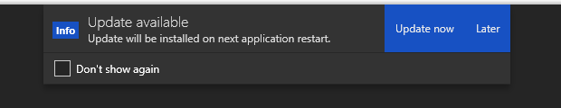

# Enterwell Client WPF - Notifications
_WPF notifications UI controls_

[](https://badge.fury.io/nu/Enterwell.Clients.Wpf.Notifications)

## Features
- Flexible styling 
- MVVM friendly
- LINQ like syntax

## Installation

Install from nuget.org feed:

```
Install-Package Enterwell.Clients.Wpf.Notifications
```

## Basics

`NotificationMessage` is the notification UI control. Three main parts are - badge, located on the most left, message in the center and buttons on the right for user interaction.

`NotificationMessageButton` is button control for user interaction with the notification. 

You can instantiate these controls manually or use `NotificationMessageFactory` that will do this for you.

The factory is used by notification message manager - `NotificationMessageManager` which is responsible for queueing and dismissing notifications.

The UI control that provides support for multiple notifications is `NotificationMessageContainer`. This control can be placed in the main window, and it needs manager to be assigned. It will then handle all notification queue/dismiss operations for you. 

## Basic usage

In your window XAML, place the `NotificationMessageContainer` control. You can bind the manager to your view model and obtain the manager via DI or some other mechanism; or you can just assign the manager instance from the backend.

```c#
this.Manager = new NotificationMessageManager();
```

```xml
<controls:NotificationMessageContainer Manager="{Binding Manager}" />
```

### Simple "info" notification


```c#
manager.CreateMessage()
       .Accent("#1751C3")
       .Background("#333")
       .HasBadge("Info")
       .HasMessage("Update will be installed on next application restart.")
       .Dismiss().WithButton("Update now", button => { })
       .Dismiss().WithButton("Release notes", button => { })
       .Dismiss().WithButton("Later", button => { })
       .Queue(); 
```

`CreateMessage` on manager creates an empty notification message. We then set the accent and background brushes. `HasBadge` and `HasMessage` will populate the notification badge and message content.

`WithButton` will create a button with the specified content (content doesn't have to be string) and specified action callback when clicked. If you place `Dismiss` before `WithButton`, your button callback will be intercepted by dismiss notification action first - the notification will be dismissed on user input.

`Queue` will enqueue the message. This will propagate the message to notification message container control which will then show the message (when multiple messages are displayed, new messages are queued to bottom of the stack)

### Simple "warning" notification


```c#
manager.CreateMessage()
       .Accent("#E0A030")
       .Background("#333")
       .HasBadge("Warn")
       .HasMessage("Failed to retrieve data.")
       .WithButton("Try again", button => { })
       .Dismiss().WithButton("Ignore", button => { })
       .Queue();
```

### Enable notification message animations (_opt-in feature_)

```c#
manager
    ...
    .Animates(true)
    .AnimationInDuration(0.75)
    .AnimationOutDuration(2)
    ...
```

## Advanced usage

### Custom control overlay notification


```c#
manager.CreateMessage()
       .Accent("#F15B19")
       .Background("#F15B19")
       .HasHeader("Lost connection to server")
       .HasMessage("Reconnecting...")
       .WithOverlay(new ProgressBar
       {
           VerticalAlignment = VerticalAlignment.Bottom,
           HorizontalAlignment = HorizontalAlignment.Stretch,
           Height = 3,
           BorderThickness = new Thickness(0),
           Foreground = new SolidColorBrush(Color.FromArgb(128, 255, 255, 255)),
           Background = Brushes.Transparent,
           IsIndeterminate = true,
           IsHitTestVisible = false
       })
       .Queue();
```

The `WithOverlay` allows you to set custom overlay content. In this example a progress bar is placed on the bottom of notification control. Notice the `IsHitTextVisible` is set to `false` so that notification message buttons don't lose focus due to overlay control being over the bottom part of the buttons.

### Custom additional content for notification



```c#
manager.CreateMessage()
       .Accent("#1751C3")
       .Background("#333")
       .HasBadge("Info")
       .HasHeader("Update available")
       .HasMessage("Update will be installed on next application restart.")
       .Dismiss().WithButton("Update now", button => { })
       .Dismiss().WithButton("Later", button => { })
       .WithAdditionalContent(ContentLocation.Bottom,
       new Border
       {
           BorderThickness = new Thickness(0,1,0,0),
           BorderBrush = new SolidColorBrush(Color.FromArgb(128, 28, 28, 28)),
           Child = new CheckBox
           {
               Margin = new Thickness(12, 8, 12, 8),
               HorizontalAlignment = HorizontalAlignment.Left,
               Content = "Don't show again"
           }
       })
       .Queue();
```

In this example a custom "Don't show again" checkbox is located at the bottom of the message.

You can add additional content to following locations: `Top, Bottom, Left, Right, Main, AboveBadge`.

### Multiple notification

The `NotificationMessageContainer` has build-in support for showing multiple notifications at the same time. New notifications will show at the bottom of the message stack.


### Don't like extension methods?

Extension methods don't hold any complex logic for instantiating notifications so you can still build the notification message using just `NotificationMessageBuilder` class directly, without extension methods.

```c#
var builder = NotificationMessageBuilder.CreateMessage();
builder.Manager = this.Manager;
builder.Message = this.Manager.Factory.GetMessage();
builder.SetAccent(Brushes.DodgerBlue);
builder.SetBackground(Brushes.DimGray);
builder.SetBadge("Info");
builder.HasMessage("This notification is built without extension methods.");

var notificationButton = this.Manager.Factory.GetButton();
notificationButton.Content = "This is much longer";
notificationButton.Callback = (button) =>
{
    this.Manager.Dismiss(builder.Message);
    // ... Do the rest
};

builder.AddButton(notificationButton);
builder.Manager.Queue(builder.Message);
```     

### Don't like the builder?

Standard control instantiation is supported too. 

```c#
this.Manager.Queue(new NotificationMessage
{
    Message = "Works event without message builder",
    BadgeText = "Info",
    AccentBrush = Brushes.Orange,
    Background = Brushes.Black,
    Buttons = new ObservableCollection<object>
    {
        new NotificationMessageButton()
        {
            Content = "Great!",
            Callback = button => { }
        }
    }
});
```

### XAML only? Supported too. You get the idea.

## Development

Pack NuGet: `nuget pack -Prop Configuration=Release`